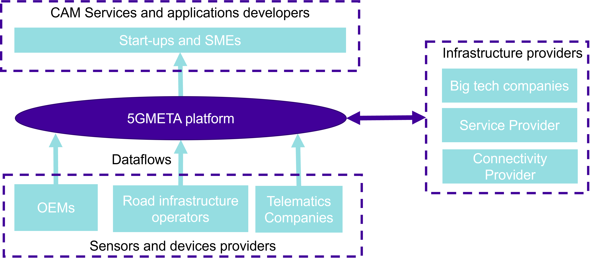
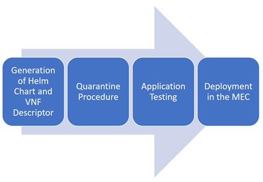
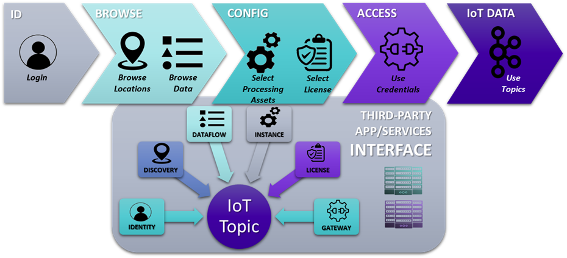
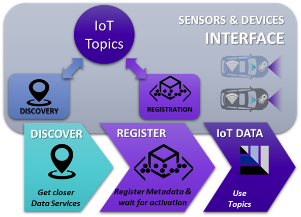

# The 5GMETA Plateform


## Table of Content

1. [Introduction](#introduction)
    1.  [Overview](#overview)
    2.  [User Profiles](#user-profiles)
    3.  [Plaform instantiation of Low Latency Data services](#low-latecies)
2. [Architecture](#architecture)
    1. [Cloud Platform](#cloud-platform)
    2. [MEC Platform](#mec-platform)
    3. [Sensors and Devices](#sensors-and-devices)
    4. [Third Parties](#third-parties)
3. [Deployment of the  5GMETA Platform](#deployment)
    1. [Cloud Platform](#cloud-dep)
    2. [MEC Plateform](#mec-dep)
    3. [Sensors and Devices](#sd-dep)
4. [Testing](#testing)
    1. [Cloud Platform](#cloud-test)
    2. [MEC Platform](#mec-test)
5. [Governace]()
6. [Credits](#credits)
7. [Conclusions and Roadmap](#conclusion)
8. [Cite this work](#citethiswork)
9. [Where to go from here]()
   1. [Fondamental Concepts](./docs/concepts/README.md)
   2. [Platform Monitoring](./docs/metering/README.md)
   3. [Tutorials](./docs/tutorials/README.md)
   4. [Third parties](./third-parties//README.md)

## Introduction <a name="introduction"></a>

This project is a new version of the 5GMETA open source platform published at the end of the H2020 5GMETA project. The original project is available here: https://github.com/5gmeta/5gmeta

The [5GMETA](https://cordis.europa.eu/project/id/957360) Platform is an open data-centric Internet of Things (IoT) messaging platform for [Connected and Automated Mobility (CAM)](https://digital-strategy.ec.europa.eu/en/policies/connected-and-automated-mobility) applications and service providers. The [5GMETA](https://cordis.europa.eu/project/id/957360) Platform creates a CCAM data monetization ecosystem that allows different stakeholders along the data value chain to exploit data in a more effective and profitable way.

A fundamental principle supported by the [5GMETA](https://cordis.europa.eu/project/id/957360) Platform is that of achieving a total decoupling between Data Producers and Data Consumers. This means that Data Producers do not need to be directly connected to Data Consumers. The [5GMETA](https://cordis.europa.eu/project/id/957360) Platform acts as a broker between Data Producers (vehicles or RSUs) and Data consumers (third-party applications or services). However, the 5GMETA Platform is not a simple publish-subscribe broker, and it includes functions for data management, [data monetization](https://zenodo.org/records/13771538) and cybersecurity as well as providing data access mechanisms. The [5GMETA](https://cordis.europa.eu/project/id/957360) platform provides secure end-to-end data management services such as data anonymization, encryption, packaging/formatting, computing and sharing mechanisms.
In contrast with a Data Lake, the 5GMETA Platform provides live data delivery. The users of the [5GMETA](https://cordis.europa.eu/project/id/957360) Platform receive the data from the subscribed dataflows in a continuous manner with no storage service within the 5GMETA Platform rather than the required memory buffering.

The 5GMETA open platform aims to leverage car-captured data to stimulate, facilitate and feed innovative products and service. This platform intends to catalyse data and provide OEMs, SMEs and high-tech start-ups with them in order to feed their innovative services and ideas and, ultimately, generate revenues.

It is designed to operate as a common infrastructure for implementing data pipelines for heterogeneous [Connected, Cooperative and Automated Mobility (CCAM)](https://transport.ec.europa.eu/transport-themes/smart-mobility/cooperative-connected-and-automated-mobility-ccam_en) applications.

<p align="center">


Platform Overview
</p>

[5GMETA](https://cordis.europa.eu/project/id/957360) Plateform is an interactive platform that functions as a broker between data producers (such as vehicles or road sensors) and data consumers (such as app providers). With the [5GMETA](https://cordis.europa.eu/project/id/957360) Platform, data consumers can subscribe to specific data flows and decide how to use and deploy them: process them, store them or discard them. The [5GMETA](https://cordis.europa.eu/project/id/957360) Platform allows data to be decoupled from their producers, thus eliminating the necessity of creating direct links between producers and consumers. Nevertheless, the [5GMETA](https://cordis.europa.eu/project/id/957360) Platform does not only act as a broker, but it also includes functions that address data management, data monetization and cybersecurity.

<p align="center">


Architecture of the 5GMETA Platform
</p>

### [5GMETA](https://cordis.europa.eu/project/id/957360) Platform User profiles definition <a name="user-profiles"></a>

Three main profiles have been identified to interact with the data platform and are the following:

- CCAM services and applications developers
- Sensors and Devices providers
- Infrastructure providers

Figure below illustrates the main relation of these different categories with the [5GMETA](https://cordis.europa.eu/project/id/957360) Platform and the principal stakeholders for each of these three profiles.

<p align="center">


User profiles overview
</p>

### Platform instantiation of Low Latency Data services <a name="low-latencies"></a>

Third Parties utilizing the [5GMETA](https://cordis.europa.eu/project/id/957360) Platform can request the deployment of a CCAM application in a [MEC](https://www.etsi.org/technologies/multi-access-edge-computing) server of the [5GMETA](https://cordis.europa.eu/project/id/957360) platform. By leveraging the direct access to the 5G network of data producers, these deployments enable swift information retrieval, significantly reducing latency. Additionally, the [MEC](https://www.etsi.org/technologies/multi-access-edge-computing) offers optimized edge computing capabilities, enhancing scalability, reliability, and resource utilization.

To ensure the security and integrity of the [MEC](https://www.etsi.org/technologies/multi-access-edge-computing), a stringent deployment procedure is followed. The procedure for this deployment works as follows:

1. Contacting the [5GMETA](https://cordis.europa.eu/project/id/957360) Operator: the Third Party provides essential artifacts, including the [Helm chart](https://helm.sh/docs/topics/charts/) and the [VNF (Virtual Network Function) descriptor](https://osm.etsi.org/gitlab/vnf-onboarding/osm-packages), to the [5GMETA](https://cordis.europa.eu/project/id/957360) Operator.
2. Quarantine Procedure: the [5GMETA](https://cordis.europa.eu/project/id/957360) Operator deploys the application in a dedicated test environment.
3. Testing Application Behaviour: during this phase,  the [5GMETA](https://cordis.europa.eu/project/id/957360) Operator conducts comprehensive testing to validate the application correct behaviour. These tests verify the proper utilization of the MEC resources and the correct access to the [5GMETA](https://cordis.europa.eu/project/id/957360) data.
4. Deployment in the MEC environment: once the application passes the tests, it can be deployed on demand by the Third Party, using the same technical procedure used to deploy the modules of the MEC pipelines.


<p align="center">


Procedure to instantiate a Low Latency Data service
</p>


## Terminology <a name="terminology"></a>

### Tiles

**Geographic Data Tiles** are a way of organizing and distributing large datasets of geographic information, such as satellite imagery or digital maps. **Each tile represents a specific geographic area**, and the data within each tile is typically organized into a regular grid or matrix. By dividing data into tiles, it becomes easier to manage and distribute large datasets, as users can selectively download only the tiles they need.

In this consuming guide file, we provide information about the geographic areas covered by our dataset tiles [Datasets available within tiles](./tests/datasets/README.md) , along with instructions on how to access and use the data. By using tiles to organize and distribute our data, we aim to make it more accessible and easier to use for a wide range of applications.

### Datatypes

5GMETA Platform provide wide range of **Datatypes** :

-  **[ETSI Cooperative Intelligent Transport Systems (C-ITS)](https://www.etsi.org/technologies/automotive-intelligent-transport)  messages (CAM, DENM, etc.)** converted in JSON.

<p align="center">


Example of C-ITS datatype
</p>


- **Images** in **JPG** Format

<p align="center">


Example of Image datatype
</p>

-  ***Video Streams*** in **H.264** video standard Format (x264 implementation)

A **Datatype** is a type of data that the S&D share and a Piepeline in a MEC accept and handle.

### Dataflow

A Dataflow is a unique flow/stream of produced data that is shared by a S&D through a Pipeline in a MEC.

### Pipeline

A **Pipeline** is a group of Modules (containers) running in a MEC to handle a specific data-type. Each modules can process the data received subscribing a queue/topic and generate output data in a new queue/topic into the MEC’s message broker.
A Module is a container running in a MEC that hande a specific data-type or group of data-type (e.g. C-ITS messages). Modules should be Pub/Sub application.

### InstanceTypes

5GMETA Platform offers a range of computing resources for users to choose from which are regrouped in **Instance Types**:
Instance types refer to different configurations of computing resources that are available for users to choose from when setting up their virtual machines or cloud computing instances. In this example, we have four different instance types with varying amounts of CPU, GPU, and memory resources:
  1. "***small***" instance type: This instance type has 2 CPUs, 2GB of memory, and no GPU.
  2. "***medium***" instance type: This instance type has 4 CPUs, 4GB of memory, and no GPU.
  3. "***large***" instance type: This instance type has 8 CPUs, 8GB of memory, and no GPU.
  4. "***advanced***" instance type: This instance type has 8 CPUs, 8GB of memory, and a GPU.

The instance types are identified by unique type IDs (type_id) and human-readable names (type_name) to make it easier for users to select the type of instance that best suits their needs.


<p align="center">


Example of Instance types
</p>


### 3rd-parties

A **Third Party application** is an application/service lying outside the 5GMETA Platform, which act as a Third Party, consuming 5GMETA Data, and potentially pushing events to the 5GMETA platform (e.g. a CCAM application).

## Architecture <a name="architecture"></a>

The [5GMETA](https://cordis.europa.eu/project/id/957360) platform has 3 main components: Cloud, MEC and Sensors&Devices.

### Overview of the 5GMETA Platform components  <a name="overview"></a>
<!-- table with components, link and one sentence describing component -->

This section presents the repositories of the main modules of the [5GMETA](https://cordis.europa.eu/project/id/957360) Paltform orgasined by platform components: Cloud, MEC and Sensors and Devices.

| Platform Component| Module          | Description             |
|-------------------|-----------------|-------------------------|
|[Cloud]()          | [cloud-apiserver](https://github.com/Akkodis/cloud-instance-api)   | This API is the central access point to request to the different MECs that are part of the platform to deploy instances on them depending on instancetype and datatype. This new apiserver is combines the discover, dataflows nd license apis is a single server.|
|                   | [identity](https://www.keycloak.org/)| Conntains the implementation of the Identity and Acess Management using  Keycloak and the user information manager.  |
|                   | [dashboard](https://superset.apache.org/)           | The main objective of the dashboard is to provide a graphical interface to the data consumers allowing them to benefit from the 5GMETA platform features that are otherwise only accessible using API requests. |
|                   | [Apache Kafka]() | C-ITS ata exchange. |
| [MEC]()           | [message-data-broker](https://github.com/Akkodis/message-data-broker) | Contains an ActiveMQ message broker to be deployed in the MEC. |                                                                                                                                                                                                                                                             |                   | [edge-apiserver](hhttps://github.com/Akkodis/edge-instance-api)        | Contains the API to manage the Edge Instance and Registration. |
|                   | [video-stream-broker](https://github.com/Akkodis/video-stream-broker) | Provides the modules to push a video stream to the MEC infrastructure and how the Broker performs the signalling and the streaming of Video flows in a standard way.|
|[Sensors and Devices]()| | Contains a set of Vagrant files and Python codes to test a vehicle |


### CLOUD Platform  <a name="cloud-platform"></a>

[5GMETA](https://cordis.europa.eu/project/id/957360) Cloud platform is deployable in any Kubernetes cluster.  A deployment is illustrated by the next figure which also shows the modules that form this Cloud Platform.

<p align="center">


Illustration of the Cloud Platform
</p>


### Cloud Services shortcuts

The [5GMETA](https://cordis.europa.eu/project/id/957360) platform provides various building blocks that developers can use to develop CCAM applications on top of the platform.
These building blocks include Identity, Discovery, Dataflow, Instance Type, License, Data Gateway which can be used as follows:


1.	[API Server](https://github.com/Akkodis/discovery): This building block enables developers to browse available MECs, locations, and tile coverage to select the desired locations, Dataflows and Licenses.
2.	[Identity](https://www.keycloak.org/): Developers can use this building block to retrieve the OpenID configuration and request access tokens to authenticate API requests.
3.	[Dashboard](https://superset.apache.org/)

After all the necessary operations have been performed, the [5GMETA](https://cordis.europa.eu/project/id/957360) platform processes the request and provides the credentials needed to connect to the platform and Kafka topic to start consuming and building their application on top of [5GMETA](https://cordis.europa.eu/project/id/957360).

<p align="center">


5GMETA Platform APIs to Sensors and Devices developers
</p>

### MEC Platform <a name="mec-platform"></a>

The architecture of the MEC Platform and its modules  are illustrated  by the figure below.

<p align="center">


MEC Platform
</p>


### Sensors and Devices <a name="sensors-and-devices"></a>

The 5GMETA platform exposes a set of APIs for Sensor&Devices developers to register and manage data flows to start sending Data to the platform, these building blocks include Discovery and Registration as described below.

1.	[Discovery](https://github.com/Akkodis/discovery): The building block allows Sensors and Devices developers to discover available MECs and their locations based on their geographical location and tile coverage to be forwarded to the nearest MEC to register your dataflow.
2.	[Registration](https://github.com/Akkodis/registration): This building block allows developers to register a data flow by providing metadata related to the data flow. The output of this method is a JSON containing the ID of the generated data flow, the topic where to publish, and a Boolean indicating whether or not there is a consumer listening for that type of data.

Once a consumer connects to the data registered, the 5GMETA platform will update the Boolean value in order to start producing data to the connected parties. This will trigger a keepalive mechanism to determine which data flows are still active. The output of this method is the same information retrieved at the registration, including the ID of the data flow and its metadata.

<p align="center">


5GMETA Platform APIs to Sensors and Devices developers
</p>


5GMETA platform supports three types of data provided by sensors and devices: cits messages in JSON, images and video streaming.

### Third Parties <a name="third-parties"></a>

c.f [5GMETA Platform interactions with 3rd-parties](third-parties/README.md)

## Deployment <a name="deployment"></a>

### Cloud Platform <a name="cloud-dep"></a>

Before deploying the Cloud Platform, modify its Helm chart values especially:

```yaml
global:
   tls:
      issuer: &globalissuer "ca-issuer or letsencrpt-staging"
   cloudplatform:
      hostname: &globalhostname "your-fqdn"
      scheme: &globalscheme "https"
      deployment: dev
      username: &globalusername "your username"
      password: &globalpassword "your password"
      dbrootpassword: &globaldbrootpassword "root password"

   oauth2:
     issuer: your-fqdn/identity
     realm: 5gmeta
     apisix:
       client: apisix
       secret: "your apisix client secret."
```

For more details on the deployment of the Cloud Platform see: [README](https://github.com/Akkodis/Cloud-Platform/blob/main/README.md)

### MEC Platform <a name="mec-dep"></a>

For more details on the deployment of the MEC Platform see: [README](https://github.com/Akkodis/MEC-Platform/blob/main/README.md)

### Sensors and Devices <a name="sd-dep"></a>

For more details on the deployment of the MEC Platform see: [README](https://github.com/Akkodis/Sensors-and-Devices/blob/main/README.md)

## Testing

The testing of the 5GMETA project is detailed in this [README](./docs/testing/README.md)

### Access to the Cloud Platform  <a name="cloud-test">

After a successful deployment, the instance of the Cloud Platform is accessible using the following URLs:

**APIs:**

- API server  UI: [https://your-fdqn/discovery-api/ui/](https://your-fdqn/api/v1/ui/)
**Kafka Platform:**

- Brokers (Bootstrap): your-fdqn:31090, your-fdqn:31091, your-fdqn:31092
- Registry: [https://your-fdqn:31081/](https://your-fdqn:31081/)
- KSQLDB: [https://your-fdqn:31088/](https://your-fdqn:31088/)
- Kafka UI: [https://your-fdqn/kafka-ui/](https://your-fdqn/kafka-ui/)

**Other services:**

- Keycloak:  [https://your-fdqn/identity/admin/](https://your-fdqn/identity/admin/)
- Grafana:   [https://your-fdqn/grafana/](https://your-fdqn/grafana/)
- Dashboard: [https://your-fdqn/](https://your-fdqn/dashboard/).

### Access to the MEC Platform  <a name="mec-test">

After a successful deployment, the instance of the MEC Platform is accessible using the following URLs. The different services can be accessed in the next ports:

- OSM UI in port [https://your-mec-fqdn](https://your-mec-fqdn)
- OSM API (Orchestration API) in port https://your-mec-fqdn
- Grafana UI in port [https://your-mec-fqdn/grafana/](https://your-mec-fqdn/grafana/)
- 5GMETA Edge Instance API [https://your-mec-fqdn/edgeinstance-api/](https://your-mec-fqdn/edgeinstance-api/)
- 5GMETA Registration API [https://your-mec-fqdn/registration-api/](https://your-mec-fqdn/registration-api/)
- 5GMETA Message-Brokers:
   - [Port 8161 for Broker UI](https://your-mec-fqdn/broker-ui/)
   - [Port 5673 for producing data, clients)](https://your-mec-fqdn:5673)
   - [Port 61616 of ActiveMQ, Kafka Connectors, Internal](https://your-mec-fqdn:61616)
   - https://your-mec-fqdn:5673 (SB) and https://your-mec-fqdn:61616 (NB)
- 5GMETA Video-Broker in https://your-mec-fqdn:8443/, :<32000-32098>

## Credits <a name="credits"></a>

The work presented in this repository was a collabortive effort by several teams and the following contributors:
- Angel Martin,
- Arslane HAMZA-CHERIF,
- [Djibrilla Amadou Kountche](https://github.com/dakountche)
- Federico Princiotto,
- Federico Princiotto,
- Felipe Mogollon,
- Francesco Aglieco,
- Juan Diego Ortega
- Kamel Khenessi,
- Khaled Chik,
- Laeticia Calice,
- Mandimby Ranaivo R. ,
- Martin Jombe Moukouri,
- Mikel Seron,
- Mohamed Tarhouni,
- Pierre Merdrignac,
- Quentin Wephre,
- Ricardo Benedetti,
- Theo Dupont,
- Wisal Mechi,

### :raising_hand: Contributing to the platform

Contributions are welcome :blush: See [how to contribute](./CONTRIBUTING.md).


## Conclusion and Roadmap <a name="conclusions"></a>

This document describes several aspects of 5GMETA Platform including its architecture and deployment in development environments.
The reader is invited to visit the following website for more details about the H2020 5GMETA project:

- https://cordis.europa.eu/project/id/957360

In terms of roadmap, we are working to improve the Platform. These modifications will be done:
- Upgrade and various improvments of the Python projects are needed (APIs)
- Upgrade of the Angular project is needed
- Upgrade of the Java project "User Business Information" is needed
- Update Apache Kafka distribution:
   - Strimzi

## Cite this Work <a name="citethiswork"></a>

1. Apruzzese, Michela, et al. Connecting Data Providers with Data Consumers: the 5GMETA Data Monetisation Framework. 2023 IEEE 47th Annual Computers, Software, and Applications Conference (COMPSAC). IEEE, 2023.
2. Mogollón, Felipe, et al. "Benchmarking 5G MEC and Cloud infrastructures for planning IoT messaging of CCAM data." 2023 IEEE 26th International Conference on Intelligent Transportation Systems (ITSC). IEEE, 2023.
3. Kountche, Djibrilla Amadou, et al. "Monetisation of and Access to in-Vehicle data and resources: the 5GMETA approach." arXiv preprint arXiv:2208.11335 (2022).
4. Canova, Clara, et al. "Driving Safety & Awareness Cooperative Business Model exploiting the 5GMETA platform." 2022 IEEE Future Networks World Forum (FNWF). IEEE, 2022.
