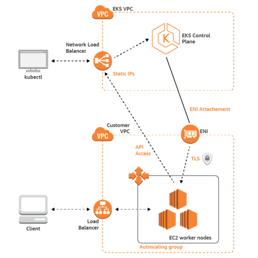

# Cloud platform deployment on AMAZON Elastic Kubernetes Service

## Introduction

The 5GMETA Cloud Platform was deployed on Amazon Elastic Kubernetes Service ([Amazon EKS](https://docs.aws.amazon.com/eks/latest/userguide/getting-started.html)). For more information, see  [Creating an Amazon EKS cluster](https://docs.aws.amazon.com/eks/latest/userguide/create-cluster.html)  and  [Amazon EKS nodes](https://docs.aws.amazon.com/eks/latest/userguide/eks-compute.html).


The following picture shows the architecurte of an AWS EKS cluster:



## Prerequisites

The followng tools are needed:
- Terraform
- [Kubectl]((https://docs.aws.amazon.com/eks/latest/userguide/install-kubectl.html))
- [Eksctl](https://docs.aws.amazon.com/eks/latest/userguide/eksctl.html).
- [AWS CLI](https://docs.aws.amazon.com/cli/latest/userguide/cli-chap-install.html)  in the AWS Command Line Interface User Guide. After installing the AWS CLI, we recommend that you also configure it. For more information, see  [Quick configuration with  `aws configure`](https://docs.aws.amazon.com/cli/latest/userguide/cli-configure-quickstart.html#cli-configure-quickstart-config)  in the AWS Command Line Interface User
- [ Helm](https://helm.sh/docs/intro/install/).
- AWS account and associated credentials that allow you to create resources.

After creating an AWS account, export the AWS Credentials

```bash
export AWS_ACCESS_KEY_ID=
export AWS_SECRET_ACCESS_KEY=
```

## Deploy the 5GMETA Platform using Terraform

```bash
cd cloud-platform/deploy/terraform/aws
terraform init
terraform apply
```

This command will create and EKS cluster and install the 5GMETA-Platform using the Helm chart.


## Conclusion

